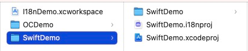

**欢迎您使用`Fella`！！！**

`Fella`是一款针对Xcode项目辅助处理开发中i18n内容的工具，其中提供了很多实用的功能，大大的简化了开发过程中的本地化操作，并使您的开发效率有很大的提升。

## 1. Fella 简介

### 1.1 先看几个问题

- 什么是本地化？

  可以看看[Apple的官方说明和教程](https://developer.apple.com/localization/#localize)，简单来说，就是让您的app在不同的国家地区，显示对应语言的内容。

- 什么是i18n？

  其实是 `Internationalization`的缩写，在`i`与`n`之间还有18个字母，所以就简写为`i18n`。

### 1.2 strings简介

在我们正常开发过程中，对于项目支持的每种语言都会配置对应的strings文件，我们这边的书写方式如下：

```objc
// Comment: 鲨鱼属于脊椎动物门软骨纲(Chondrichthyes)板鳃亚纲，海生，少数种类进入淡水，为一群游速快的中大型海洋鱼类。
// Tags: animal, carnivores, sea
// 鲨鱼
"com.auu.localization.test.animals.sharkNameKey" = "Shark";
```

其中有四类内容：

1. **第一行** comment，对于当前字符串的注释说明，可以用来解释当前字符串是干什么用的、怎么用的、在哪儿用的等等，这个部分是非必需的，我们在开发的时候也是很少去添加；
2. **第二行** tags，对于当前字符串的分类，用来对字符串内容做业务、用法、功能等的分类，这个在开发时也很少用；
3. **第三行** 使用者自己熟悉的语言内容，比如您的项目支持汉语、英语、日语、德语等等，但是您对汉语最熟悉，如果当前是在日语的strings文件里的话，对于显示的字符串内容可能就会看不懂，所以加上对应的汉语内容，这样，在各语言文件中您都可以轻松看懂对应的字符串内容。
4. **第四行** 主要的字符串内容，格式是 `"identifier" = "value"`，做过本地化的都会清楚这种写法，在Fella里，前面这部分叫做**`Identifier`**，也叫**字符串标识**，在后续的内容中也都会这么叫。

落实到项目中，我们会这样用：

```
NSLocalizedString("com.auu.localization.test.animals.sharkNameKey", comment: "鲨鱼")
```

通过使用各业务对应的`identifier`来本地化语言资源，但是，`identifier`是一个字符串，编译器不会对它的对错做检查，而且在编写的时候没有任何提示。

想一想，如果某个字符串你使用了100遍，又假如你写错了几次，上线后会是什么后果？

### 1.3 常量文件

为什么要写常量文件呢？简单来说就是编译器会帮忙检查写的对错啊～～书写的时候有提示啊～～

所以，对于**1.2**里的问题，我们都会使用字符串常量来代替`identifier`的使用，如下：

```
let lTestAnimalsSharkNameKey = "com.auu.localization.test.animals.sharkNameKey"
```

当然，书写方式和命名规则各有各的想法，总之会有一个文件，里面全是字符串常量对应字符串类型的`identifier`。

再来一次使用：

```
NSLocalizedString(lTestAnimalsSharkNameKey, comment: "鲨鱼")
```

是不是方便多了？

当然，**为了书写或者自定义的方便，我们也会对`NSLocalizedString`方法做自己的封装处理**，那这当然是看自己习惯啦。

### 1.4 资源目录

这时候我们的资源目录可能就是这样的：

```
├── Localization.swift
├── de.lproj
│   └── Localizable.strings
├── en.lproj
│   └── Localizable.strings
├── ja.lproj
│   └── Localizable.strings
└── zh-Hans.lproj
    └── Localizable.strings
```

文件的数量随着支持语言的增加而增加，而我们在每次添加一个新的字符串的时候，都必须：

- 把每个文件都修改一次
- 确保每次写的`identifier`都一致
- 确保没有重复的`identifier`
- 确保整行内容书写合法，没有漏写、错写内容
- 确保没有文件被遗漏
- 确保字符串中的双引号、换行符都有被正确转义
- 确保加了末尾的分号
- ...

而Fella，就是为了处理这些问题而生的，我们继续往后看。

## 2. i18n文件介绍

使用Fella执行保存操作(**`command + S`**)的时候，会生成一个`.i18nproj`文件，这是Fella对于您使用过程中各种设置、权限的缓存文件，方便您下次操作的时候直接打开使用。

重要的是，有了这个文件，即使您发给别人也照样可以编辑查看，哪怕说他的Mac上没有您所操作的Xcode项目，我们姑且称这种模式为编辑模式。




## 3. 协作开发

`i18nproj`文件中的数据做了特别的格式处理，方便您在多人合作开发中的使用，您可以把`i18nproj`文件放到`xcodeproj`同级目录，然后使用Git来做多分支管理。


## 4. 主页面

先看下主页面样子，主要分为以下几类：

- 顶部是功能导航区
- 左中是各语言字符串及相关内容显示区
- 左下是操作日志显示区
- 右中是新建、修改、显示字符串、分组内容区
- 右下是当前项目本地化进度展示区

各内容我们后面详细介绍。。。

