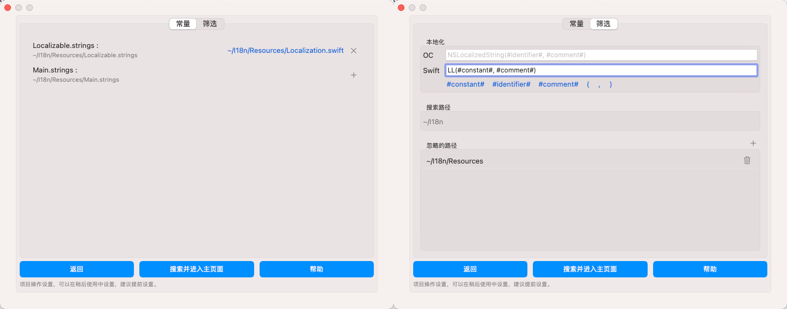

# 启动app 新建项目


Fella是一款文档工具类APP，所以有类似于Xcode一样支持快速启动的操作，下面我们从启动app开始。

启动app后，在右侧会有三个按钮以供操作。


---

## 1. 选择Xcode项目目录（新建项目）

选择需要处理的Xcode项目所在的文件夹，如果您选择的项目比较大，在选择后会经过一点时间的等待，用于查找所有有效的“strings”文件。

> 让用户去选择Xcode项目所在的文件夹而不是直接选择`xcodeproj`文件，是因为需要保存工作文件夹的权限，因为app如果想要上App Store，就必须有沙盒权限的限制，只能访问用户选择的文件夹或者申请了权限的文件夹，所以，为了在下次使用时不需要再次执行选择操作，才会使用选择文件夹的方案。[App Sandbox](https://developer.apple.com/documentation/security/app_sandbox/)

在确定项目有效后，会跳转到下一步，用于对项目整体的设置。

### 1.1 项目设置



#### 1.1.1 常量文件设置

就如我们开篇文章所说的，我们每个strings文件最好都应该对应着一个常量文件，以方便我们的开发，这里会把搜索到的所有strings文件都列举出来，我们可以对每个strings文件选择对应的常量文件，选择后会显示相对于项目根目录的相对路径，同时，也可以选择叉号取消选择。

如果您的常量文件是OC文件，选择对应的`.h`或者`.m`都可以，这个选择是非必需的，如果您的strings文件没有对应的常量文件，也可以不用选择。

#### 1.1.2 筛选操作设置

这一步有三个设置项：

- 本地化方法设置，是指您在项目中用于执行本地化操作的方法，也可以说是您对系统的 `NSLocalizedString` 方法做了怎样的封装，我这里为了省事，就是这样做的：

  ```swift
  func LL(_ key: String, _ comment: String? = nil) -> String {
      return NSLocalizedString(key, comment: comment ?? "comment")
  }
  ```

- 搜索路径，用于指定搜索的内容，如果您在项目中手动引入了过多的第三方内容进入，为了节省一些文件遍历，可以选择您需要的主工程目录
- 忽略的路径，是对于上一条的补充，在您选的路径下，如果有些目录下的内容不需要筛选，可以在这里过滤掉。在使用的时候我也会主动的忽略Pods目录和一些隐藏目录，减少文件遍历的复杂度。

#### 1.1.3 其他提醒

上述两个操作可以在后续使用中补充设置，但是为了使用的流畅性，还是建议在初始的时候都给添加上。如果您暂时不想使用，还可以点击返回上一步。

### 1.2 搜索并进入主页面

在步骤**1.1**的设置都完成后，可以选择**搜索并进入主页面**开始使用，在搜索的过程中，我会这样做：

1. 搜索遍历您项目中所有的strings文件，并使用正则表达式依次遍历所有的字符串
2. 如果有重复的`key`，我会在进入主页面后的日志区域依次显示出来
3. 在遍历完所有的strings后，我会去筛选常量文件，跟对应的strings内容匹配起来
4. 如果常量内容里某一条内容没有找到对应strings的key，我会忽略这一条
5. 搜索完成进入下一步

### 1.3 选择数据类型 (Fella 版本 2.0.0及以上版本)


在2.0.0版本以前，执行**1.2**步以后，会直接进入主app，从2.0.0版本开始，我在项目中增加了一项数据类型的选择，先看一下两种类型：

- 单个文件保存

  > 把所有信息都保存到`i18nproj`内的同一文件里，这种方式适用于数据量比较少的情况。
  >
  > 比如您Xcode项目中所有`.strings`里的所有字符串数量之和小于10000条(每个`\"xxx\"=\"xxxx\";`算是一条)，比较适合这种方式。

- 拆分多个文件保存

  > 把所有信息按照语言和类型拆分到不同的文件里，这种情况下，如果您使用git管理`i18nproj`，那么，每一次的内容修改都会在git里产生多个变动。
  >
  > 如果您需要直观查看各种存储数据，或者数据量较大的话，推荐使用这种方式。

详细的解释在弹出的窗口中也有说明。

在使用Fella的过程中，我也希望能想Xcode Project 一样可以做到多人、多分支协作开发，这样的话就难免会互相之间有冲突产生，而且即使没有冲突，在每次有数据变动的时候，我们也希望能在SourceTree等Git操作客户端来查看变动和解决冲突，于是，我对数据做了类似`.xcodeproj`的拆分和组合，以便方便查阅和对比。

在2.0.0以前我把所有数据都存到了一个文件中(右键`.i18nproj`文件，查看包内容可以看到各种存储资源分类)，这种做法对于比较小的项目，或者本地化字符串资源较少的项目来说，还挺好，直到有一天，我在同步项目数据的时候，把`.i18nproj`文件做到了8MB的大小，在使用sourcetree去查看变动就完全不可行了(虽然可以设置Size limit)，但是文件大了的话，解析起来也是会有点困难的。

于是我在2.0.0的时候增加了一个拆分文件的功能，做成类似于xocde项目中strings类似的文件分布，这样就很好的解决了单个文件过大的问题，单同时也有另一个问题产生，如果Xcode项目支持的语言很多，那么每次数据的改动产生的文件变动会很多。

所以，我个人的建议是，**如果您是在个人使用Fella，那么什么格式都无所谓，如果您是多人协作开发的话， 看您项目的大小了。**

**重要提醒**：存储数据格式在使用中也可以修改，但是每次修改后，为了保证数据不丢失，您需要在每个用到Fella的分支都设置一次，保证各个分支的数据格式统一，然后再执行代码的合并操作，切记切记。

### 1.3 开始使用

在经过上述步骤后，就可以进入app开始使用了。

---

## 2. 打开已经存在的Fella项目


在使用Fella的过程中，我们可以随时保存当前项目为一个`i18nproj`项目文件，以方便后续使用。

如果是在您当前设备保存的某个Fella项目的话，在启动app后，会有一个最近浏览，显示您最近使用的项目列表，点击您需要打开的项目即可开始正常使用。

如果您没有在当前设备上保存过Fella项目，您可以在启动app后，选择**打开已经存在的Fella项目**选项来选择打开一个本地存在的Fella项目，或者直接在本地双击`i18nproj`项目文件即可启动Fella。

### 2.1 打开在本地保存的`i18nproj`项目文件

项目会正常启动，开始使用。

### 2.2 打开一个没有在本地保存的`i18nproj`项目文件

由于Fella主要是处理Xcode项目本地化而生的，所以我会首先查一下Fella保存的项目根目录下有没有对应的Xcode项目，如果有的话，就可以正常开始使用；如果没有的话，我会提示您在本地选择对应的Xcode项目目录，当然您也可以不选择，这时候部分功能将会被限制，这种情况适用于把`i18nproj`项目文件发给产品或者其他人查看编辑使用。

### 2.3 恢复`i18nproj`项目文件中的资源内容

我会首先解析`i18nproj`项目文件中的资源信息，然后再根据所在项目路径，查找Xcode项目所在路径下的所有strings文件和常量文件，如果以Xcode项目里的资源为主，以`i18nproj`项目文件中的资源为辅，把所有资源都解析完成后，就会开始正常的使用Fella项目。

---

## 3. 查看帮助

用于打开当前网页，给初用者一个比较友好的引导。