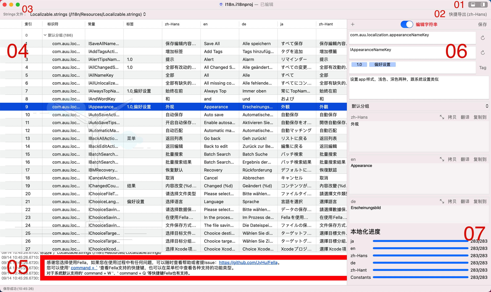

为了方便您的使用，Fella各模块间采用紧凑直观的布局方式，将各主要操作工具、重要的信息内容紧凑的排列，让您一眼即达，一触即达。

下面就让我们来简单看下各模块职责划分吧。



如图所示，我们将Fella主页面分为7个模块，下面我们来一一介绍。

> 在项目的迭代过程中，整个app的UI样式会不断的优化改善，但是整体的结构都是一样的。
>
> 如果后续整体结构有所改动，我会第一时间在这里同步更新的。

### 1. 项目导航

一键直达对应的Xcode项目所在目录，如果当前是编辑模式的话，这里将会不可点击，因为根本就找不到对应的Xcode项目。

### 2. 文件切换

在我们的项目中，每种语言都会对应一个strings文件，有时我们为了文件的拆分，又会增加不同的多语言文件，如：

```
├── de.lproj
│   ├── Localizable.strings
│   ├── Main.strings
│   └── TestLization.strings
├── en.lproj
│   ├── Localizable.strings
│   ├── Main.strings
│   └── TestLization.strings
├── ja.lproj
│   ├── Localizable.strings
│   ├── Main.strings
│   └── TestLization.strings
└── zh-Hans.lproj
    ├── Localizable.strings
    ├── Main.strings
    └── TestLization.strings
```

经过Fella解析后，就会产生这样的三个实体对象，每个strings对象下管理着其对应的各语言strings文件：

```
Localizable.strings
	├── de.lproj/Localizable.strings
	├── en.lproj/Localizable.strings
	├── ja.lproj/Localizable.strings
	└── zh-Hans.lproj/Localizable.strings

TestLization.strings
	├── de.lproj/TestLization.strings
	├── en.lproj/TestLization.strings
	├── ja.lproj/TestLization.strings
	└── zh-Hans.lproj/TestLization.strings

Main.strings
	├── de.lproj/Main.strings
	├── en.lproj/Main.strings
	├── ja.lproj/Main.strings
	└── zh-Hans.lproj/Main.strings
```

在这部分我们就会切换：`Localizable.strings`、`TestLization.strings`、`Main.strings`几个文件。

有些时候可能用了一些第三方的源码到项目中，在做资源遍历的时候会把三方源码里的strings文件也遍历到。为了避免重名导致的不方便确认，所以在切换strings文件的时候，会显式的提示文件的相对路径，避免您在使用时选择错误。

### 3. 操作功能

这部分提供了一些在开发过程中的辅助功能，具体的使用和用法，在后面单讲。

### 4. 内容区

内容区是整个项目中字符串资源的完整展示区，以表格的样式将所有字符串的各语言内容、常量、状态等等显示出来。

其中，第一列的显示的是各字符串内容的状态，包括以下几种：

- ⚠️ 表示当前字符串的标识、常量、多语言字符串等主要内容有缺失；

- ✏️ 表示当前字符串在本次使用中有编辑；

- 🌟 表示是在本次使用中新加入的内容。

同时，为了方便使用，在内容区右键会有一个辅助菜单，提供了一些辅助性的操作功能，这个后面单讲。

### 5. 内容编辑

展示、编辑多语言字符串、分组的部分。

### 6. 本地化进度

实时展示各语言内容的本地化进度，如果显示红色的，说明这个语言类型下的字符串内容有些是有缺失的。

### 7. 操作日志

展示了各主要操作的历史记录，方便您的回溯，其中所有蓝色超链接样式的内容都可点击。