Fella的内容区是整个项目中字符串资源的完整展示区，以表格的样式将所有字符串的各语言内容、常量、状态等等显示出来。

同时，在内容区还提供了一系列的右键功能，本章我们会重点介绍一下功能。

## 1. 显示内容

所有显示内容都是按照分组显示的，包括各种搜索、筛选的结果。

所有列的显示数据包括以下内容：

- 字符串状态
  - ⚠️ 表示当前字符串的标识、常量、多语言字符串等主要内容有缺失；
  - ✏️ 表示当前字符串在本次使用中有编辑；
  - 🌟 表示是在本次使用中新加入的内容。
- 字符串标识
- 常量
- 标签
- 各语言内容

所有列是可拖动改变顺序的，对于语言列的顺序改动，会同样的作用到右侧字符串编辑页面，而且这个顺序也是会记忆的，需要注意的是，**保存的顺序只会保存语言列的顺序，其他列不记。**

## 2. 搜索组件

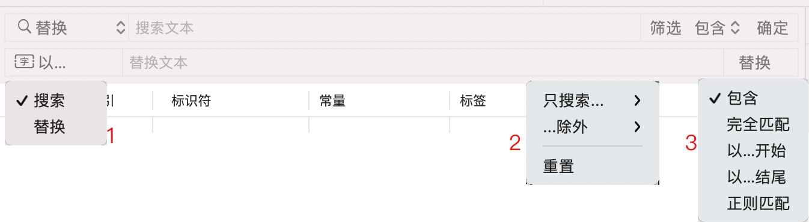

在激活app后按下`command + F`或者`command+shift+F`组合键或者在主内容区右键选择对应功能，会在内容区显示出这个页面。

### 2.1 批量处理方案

支持搜索和替换操作，如菜单1，可以在搜索框左侧选择切换

### 2.2 筛选内容

筛选内容支持两种方式，但是同时生效的只能是一种：

- **只搜索选定内容**
- **选定内容除外**

每种方式下的筛选条件会把所有语言列出，和支持筛选的列项。

### 2.3 匹配方式

支持以下匹配方式：

- **包含**，只要包含搜索内容，即算命中匹配
- **完全匹配**，必须完整匹配搜索内容，才算命中匹配
- **以...开始**，必须以搜索内容开始，才算命中匹配
- **以...结尾**，必须以搜索内容结尾，才算命中匹配
- **正则匹配**，使用正则表达式匹配搜索结果

## 3. 右键菜单

对于内容区域右键会有菜单显示，根据不同的状态显示内容也不一样：

- **筛选内容**，指的是执行了各种筛选、搜索操作后显示的结果
- **选中内容**，指的是用户在列表中选中了某些行

|  - 没有筛选内容<br>- 没有选中行内容  | - 没有筛选内容<br>- 有选中行内容 | - 有筛选内容<br>- 没有选中行内容 | - 有筛选内容<br>- 有选中行内容 |
| ------ | ----- | ---- | ----- |
| 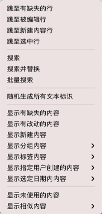 | 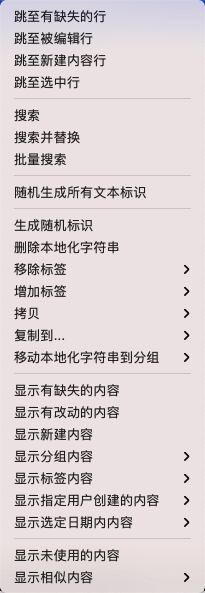 | 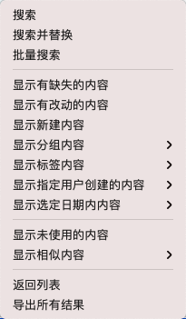 | 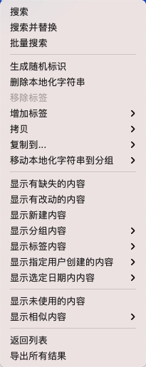 |


### 3.1 跳转类

#### 3.1.1 跳至有缺失的行

从当前选中行开始，跳转至下一个有缺失的行，如果有很多条，会依次循环跳转。

#### 3.1.2 跳至被编辑行

从当前选中行开始，跳转至下一个在本次使用中被编辑的行，如果有很多条，会依次循环跳转。

#### 3.1.3 跳至新建内容行

从当前选中行开始，跳转至下一个在本次使用中新建的内容行，如果有很多条，会依次循环跳转。

#### 3.1.4 跳至选中行

跳转至被选中的行，方便在列表滑动时快速回到被选中的位置。

### 3.2 搜索类

### 3.2.1 搜索

用于快速查找到自己需要的内容，也可以在激活app后，按下"command+F"组合键快速显示搜索组件(详细见**2. 搜索组件**)，当再次执行搜索操作的时候会自动隐藏掉搜索组件。

#### 3.2.2 搜索并替换

用于方便快捷的替换指定的内容，也可以在激活app后，按下"option+command+F"组合键快速显示搜索替换组件(详细见**2. 搜索组件**)，当再次执行搜索替换操作的时候，会自动隐藏掉搜索替换组件。

#### 3.2.3 批量搜索

支持批量搜索本地还字符串内容，但是当前只支持完整匹配字符串标识类的搜索，所有内容以换行为分隔，如：

```
com.auu.localization.chooiceLanguageNameKey
com.auu.localization.commentName
com.auu.localization.commonSettingName
com.auu.localization.compareActionName
com.auu.localization.confirmTitleName
```


### 3.3 随机生成所有文本标识

对当前选中文件中的所有本地还字符串内容做生成随机字符串标识操作，为了安全操作，如果对于当前选中文件没有选择有效的常量文件，那么会有一个提醒内容，询问您是否执行操作。

因为常量字符串是对字符串标识的有效引用，所以哪怕字符串标识有所改变，只要对应的常量没有改变，在项目中的使用的常量任然是有效的。

### 3.4 针对选中字符串内容

#### 3.4.1 生成随机标识

同第**3.3**条一样，只不过当前操作只对选中的本地化字符串内容有效。

#### 3.4.2 删除本地化字符串

直接从当前选中的文件中删除选中的本地化字符串内容。

#### 3.4.3 移除标签

| 用于给选定字符串移除标签。<br/><br/>在子菜单中显示选中字符串内容的所有标签，选中某个标签后，会遍历所有选中字符串，如果包含选择的标签类型，就会从字符串的标签列表中移除该标签。 | 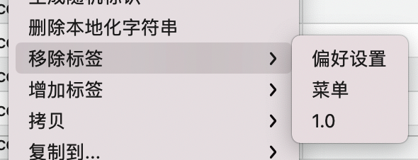 |
|--|--|

#### 3.4.4 增加标签

| 用于给选定字符串添加标签。<br/><br/>在子菜单中会显示当前本地化文件中的所有标签，选择某一项后，会对所有选中内容增加选择的标签。<br/><br/>在这里也支持新建标签，支持同时新建多个，每输入完一个，可以按回车以开启下一个标签的输入，如果取消的话，可以删除所有内容后，再点击确定。 | 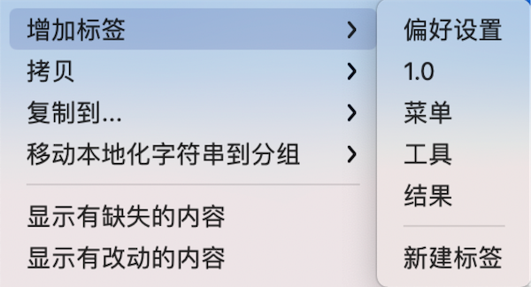 |
| ------------------------------------------------------------ | ----------------------------------------------------- |

#### 3.4.5 拷贝

| 用于拷贝当前选中的本地化字符串内容的某些特定信息，所有拷贝内容都以换行符分隔。 | 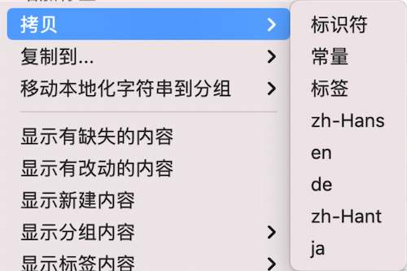 |
|--|--|

#### 3.4.6 复制到

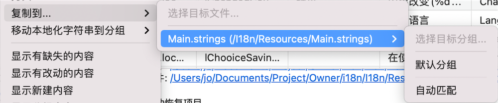

用于将选中内容复制到其他的本地化文件中。

如果选中了目标文件的某个分组，会把内容复制到选中的分组中，如果选择了自动匹配，会以当前选中的内容为主，从目标文件中查找相同的分组，如果有则会复制到目标分组中，如果没有，则会先创建一个相同的分组，然后再复制内容过去。

#### 3.4.7 移动本地化字符串到分组

| 移动选中的本地化字符串内容到指定的分组，也可以直接移动到一个新建的分组。 | 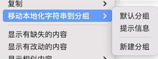 |
|--|--|

### 3.5 针对选中分组内容

#### 3.5.1 强制删除分组

删除分组的同时，将会把该分组下的所有本地化字符串内容一并删除掉(默认分组不支持被删除)，所以，一般来说，对于分组的删除是不建议的，除非说您有很强烈的需求。

#### 3.5.2 移动内容并删除分组

将当前分组的内容先移动到选定分组，然后再删除当前分组。

### 3.6 集中显示内容

#### 3.6.1 显示有缺失的内容

集中显示所有有缺失的内容，此处的缺失包含所有语言下内容的缺失和常量内容的缺失。

#### 3.6.2 显示有改动的内容

集中显示在本次使用中有改动的内容。

#### 3.6.3 显示新建内容

集中显示在本次使用中新建的字符串内容。

#### 3.6.4 显示分组内容

集中显示选中分组下的所有内容。

#### 3.6.5 显示标签内容

集中显示所有包含选中标签的字符串内容。

#### 3.6.6 显示指定用户创建的内容

集中显示所有选中用户创建的内容，该功能只在2.0.0版本及以后支持。

#### 3.6.7 显示选定日期内内容

| 集中显示选定日期内的所有内容，该功能只在2.0.0版本及以后支持。<br /><br />暂时只支持如图所示的日期区间。| 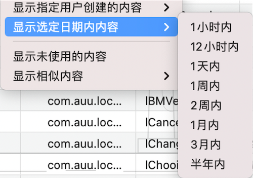 |
|--|--|

### 3.7 复杂筛选类

#### 3.7.1 显示未使用内容

遍历所有项目代码，使用当前文件中的字符串常量和字符串标识去做遍历筛选，查找所有在项目中没有使用到的内容。

#### 3.7.2 显示相似内容

| 以选定的方式全局的匹配相似内容。<br/><br/>此处的相似内容指的是整个本地化字符串的相似，在选定的语言下内容相同即表示相似，比如在复杂的"过滤所有语言"下会有如下结果： | 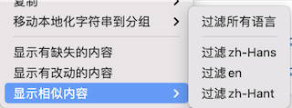 |
|--|--|

| | zh-Hans | ja       | En        |
|-----| ------- | -------- | --------- |
| 1 | 确定    | 決定する | Confirmed |
| 2 | 决定    | 決定する | Decide    |
| 3 | 确定    | 決定する | OK        |
| 4 | 好的    | OK       | OK        |

其中第一条和第4条没有任何一条内容相同，但是在数据处理的过程中，以第二行或者第三行为媒介，就会得到如上的结果。

### 3.8 筛选结果操作

#### 3.8.1 返回列表

用于在执行搜索、显示相似内容等操作后，返回到主内容列表。

#### 3.8.2 导出所有结果

用于在执行搜索、显示相似内容等操作后，导出执行操作的结果，导出的格式为CSV格式。