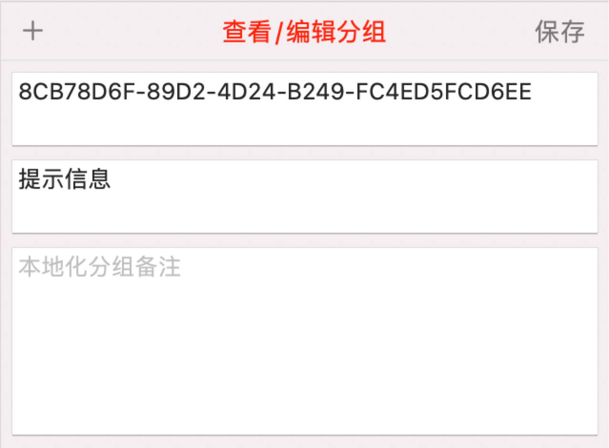
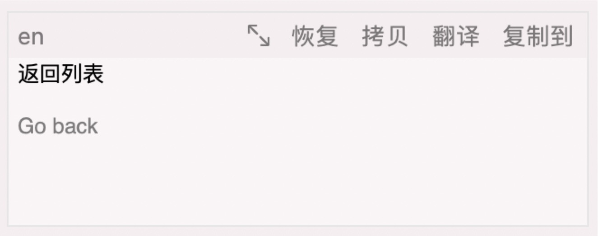

# Fella内容编辑区

Fella的内容编辑区用于展示、编辑本地化字符串和分组，在您有不同的选择的时候会有不同的展示内容和样式。

## 1. 查看模式

| 当您在左侧内容区选择多行字符串内容时，内容编辑区会显示为查看模式，这里会显示您选择的所有字符串的所有内容信息。  当然，您也可以在该区域右键筛选您所想要查看的内容，您所做的筛选类别只对当前使用过程生效，且对所有文件生效。 |  |
| ------------------------------------------------------------ | --------------------------------------------------- |

## 2. 分组

| 因为对于分组的操作比较简单，所以先说。  当您选择一个分组的时候，该区域会显示为对于分组的查看和编辑模式，您可以对该分组的信息做需要的编辑。 需要注意的是，分组ID是自动生成的，无法编辑，系统默认分组的信息也无法被编辑。   对于新建分组来说，跟编辑一个自定分组是一样的，在编辑完内容后记得都要主动保存一下。 |  |
| ------------------------------------------------------------ | ----------------------------------------------- |

## 3. 字符串

### 3.1 各可操作项简介

当操作的是字符串的时候，这边会有如下可供操作内容：

- 字符串标识符编辑框，不可为空，右侧有个刷新按钮，可以随机生成一个字符串标识
- 字符串常量编辑框，如果您当前选择的多语言文件支持常量的话，才会显示，右侧有一个刷新按钮，用于处理输入的字符串标识到当前编辑框，方便您的快捷输入
- 标签编辑框，可以提供您对于当前字符串标签的编辑，比如哪个版本加的，哪个业务线的内容，属于哪个模块等等，在右侧有一个标签选择按钮，在弹出的气泡视图里会显示当前文件中的所有标签内容以供您快速选择使用
- 备注内容编辑框，用于对当前字符串的备注说明，比如做什么用的，在哪里用的等等
- 分组选择按钮，用于选择当前字符串所在的分组
- 多语言内容编辑区域，显示各语言的内容信息，该区域会根据您所选中的多语言文件而有不同的效果
  - 如果当前文件语言数大于4个，那么语言编辑区域会变成可滑动的模式，每个编辑框的高度限定在120像素，让您能够查看到各个语言的内容，且不会因为高度不够而显示不下所有内容
  - 如果当前文件语言数小于等于4个，那么语言编辑区域会被各语言编辑框充满整个区域并且等分高度

### 3.2 语言编辑框简介

下部分为主要编辑区，会显示当前编辑的多语言字符串内容，在这里您不必关心双引号的和换行符的转义，该是怎么样就怎么写就行，在导出到想中的时候我会对所有需要转义的内容做处理，保证不会出现Xcode的编译异常。

在编辑区如果在当前使用过程中对该字符串有过改动，会在内容后面显示一个颜色淡一点的改动前的内容。

内容编辑区的左上角会显示当前编辑区对应的语言类型是什么。

在右上角会有一些辅助的功能按钮：

- 放大按钮，会把当前笔记框放大到整个字符串编辑区域，适用于专注的编辑某种语言内容，或者编辑长文本内容；当然相对的，放大后还能够缩小回来。
- 恢复按钮，如果当前语言的内容在本次使用中所有改动的时候才会显示，用于直接把内容恢复到使用时的样子。
- 拷贝按钮，用于拷贝当前内容到粘贴板。
- 翻译按钮，用于对当前编辑框内容执行翻译操作，这个功能需要您自定义翻译脚本来支持，脚本入口在Fella左上部分的操作功能区。
- 复制到按钮，用于把当前编辑框内容复制到其他语言输入框内

### 3.3 新建字符串

选择新建字符串后，所有内容都会被清空，字符串标识符会自动的生成一个随机内容，方便您的使用。

### 3.4 编辑字符串

当您选择单个字符串的时候，该区域会变成字符串编辑模式。

这里有个特别的地方，**如果您当前选中的多语言文件语言数量大于4个，那么会在编辑区的顶部显示一个切换按钮，用于切换查看和编辑模式**，也就是说，哪怕您只选择一条字符串内容，也可以显示为查看模式。这么做是因为当语言过多的时候，多语言内容编辑区会显示为可滚动的样式，那么如果您想要看到所有语言内容的话，就需要滚动编辑区域才能看到，如果语言数很多的话，就很难做直观的对比查看，所以对于语言数较多的情况下特别做了如此支持。

在您正常的编辑字符串执行保存时，如果字符串标识符或者常量内容发生了改变，会有一个提示信息对您发出询问，是否需要把项目中对应使用到的代码内容也相应的修改，如果您选择了同意，那么Fella就会遍历所有代码文件，查找使用到改动前字符串常量或者标识符的地方，并替换为新的内容。