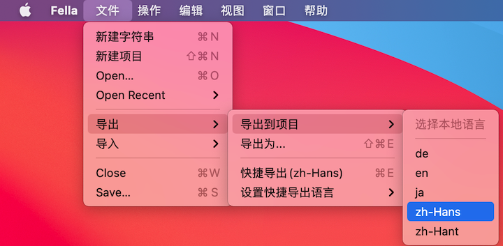
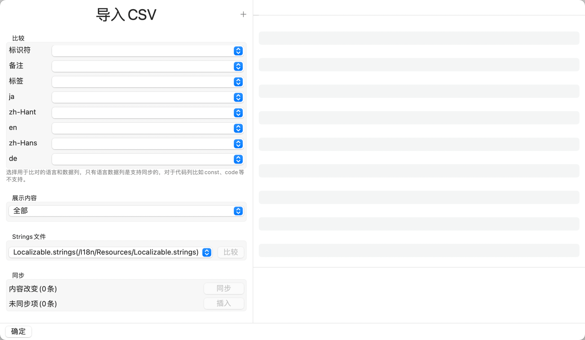
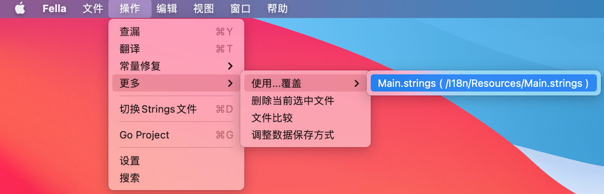
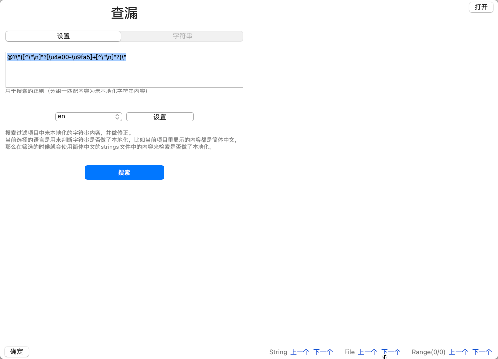
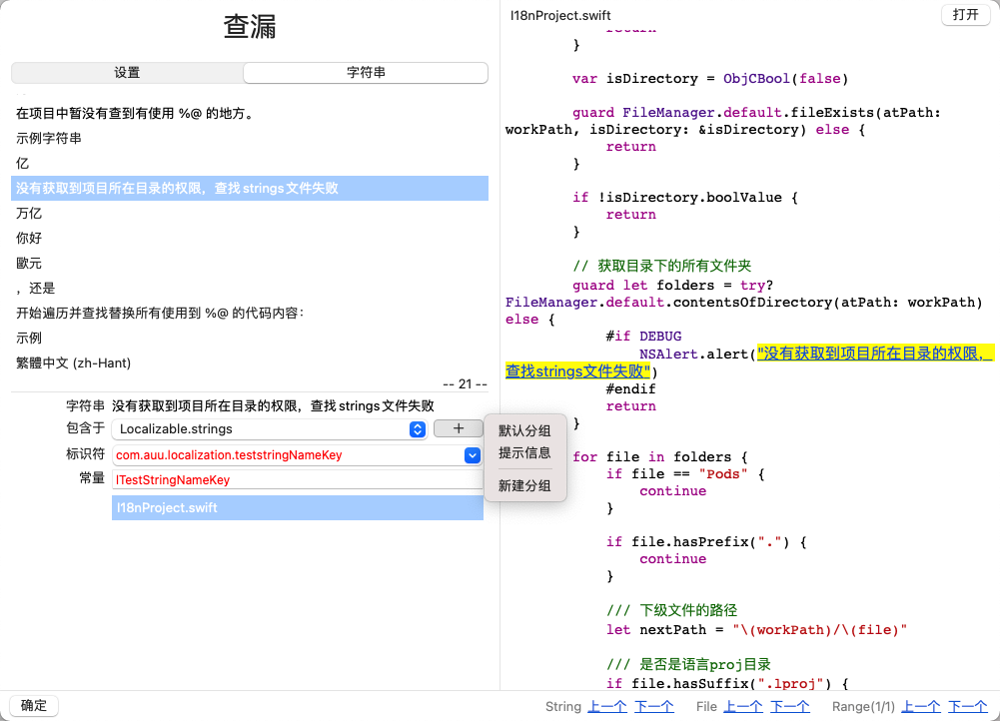
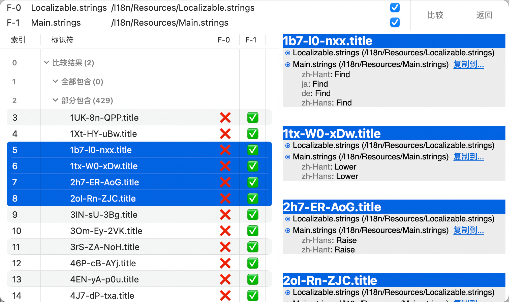
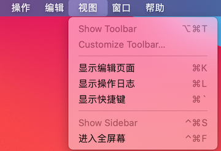

在Fella中为用户另外提供了一些快捷开发、安全校验等辅助工具，入口在顶部菜单中。

## 1. 文件



### 1.1 新建字符串

用于新建一个字符串，如果侧边栏是在隐藏状态，会主动的显示出来。

### 1.2 新建项目

从新开始创建一个Fella项目。

### 1.3 导出

用于将Fella资源按顺序整齐的输出到您的Xcode项目中。

需要注意的是，为了避免频繁的IO操作，您的每次编辑、修改等操作，只会影响Fella内的数据状态，并不会马上同步到Xcode项目中，需要您主动的来执行导出操作。

在这里提供了多种导出目标，当然最主要的还是导出到Xcode项目中，在执行导出操作的时候需要您选择一个您所熟悉的语言，用于备注其他您不熟悉的语种，比如在我的项目中有这样一个日语字符串：

```
"com.auu.localization.allChangedStringsName" = "すべての変更されたコンテンツ";
```

我是完全看不懂啊😭，所以我就需要有个我熟悉的简体中文在注释里，就像这样：

```
// Tags: 1.0
// 全部有改动的内容
"com.auu.localization.allChangedStringsName" = "すべての変更されたコンテンツ";
```

在导出的时候我会针对所有常量内容、各种语言内容都会加上这种语言内容的注释，方便您的查看。

在这里我还提供了其他几种的导出到外部的方式，您可以在使用中去尝试着看一下。


| 功能 | 快捷键                    | 说明 |
| ---------- | ------------------------------------------------------------ | ---------- |
| 导出到项目 |               | 将Fella内容以选中的语言导出到项目中。 |
| 导出为...  | command + shift + E | 将Fella内容以选中的格式导出到其他地方，支持`CSV`、`JSON`、`plist`格式。 |
| 快捷导出 | command + E | 在选择好导出语言后，可以用来快捷导出Fella内容到项目中，同时会在主页面右上角显示快捷导出的按钮 |
| 设置快捷导出语言 |  | 用于选择快速导出的语言，设置了之后会记在Strings文件中。 |

### 1.4 导入

用于批量的将外部资源导入到Fella中来统一管理，这里暂时提供了两种方式：

#### 1.4.1 JS脚本导入

Fella支持一些简单的JS交互，可以提供给您导入线上的资源进来。

#### 1.4.2 CSV文件导入



用于将CSV中的资源导入到Fella中，这个小工具也挺简单的，点击加号选择需要导入的CSV文件后，依次选择各内容项匹配的CSV中的数据列，然后选择Strings文件开始比较即可。

比较之后会提示您有多少变动的内容和未导入到项目中的内容，最后根据需求选择对应的操作按钮即可一步同步。

### 1.5 保存

- 如果当前是在做字符串、分组内容的新建或者编辑的话，会保存当前编辑内容
- 保存Fella项目到本地的`i18nproj`文件中

## 2. 操作



### 2.1 查漏

用于查找项目中所有未本地化的字符串内容。

左边是各种参数设置和编辑区域；

右侧为选中代码文件的源代码，代码上面显示的是当前代码文件的相对路径，可以直接点击“打开”来定位到Xcode项目代码文件；

在页面的底部为各种数据切换功能区，用于在搜索结果中切换自己需要处理的内容。

|             参数设置             |           字符串列表            |
| :------------------------------: | :-----------------------------: |
|  |  |

#### 2.1.1 参数设置

用于设置搜索项目中未本地化字符串的各种参数。

- 首先是一个正则表达式的编辑框，用于在遍历所有项目文件时匹配字符串用，需要注意的是，其中正则匹配结果分组一的内容为未本地化的字符串内容。

- 然后是一个语言选择按钮，用于在找到未本地化内容的时候，跟Fella里保存的对应语言的内容做比较，来确定该字符串是否已经做了本地化。
- 旁边是一个设置按钮，用于设置项目中实现本地化的方法，如果做了本地化处理的话，肯定会使用本地化的方法，如`NSLocalizedString("com.auu.localization.test.animals.sharkNameKey", comment: "鲨鱼")`，或者其他自定义的方法，如果找到的内容没有被本地化方法包含，只是单纯的字符串，那么肯定需要处理。

在所有参数都设置好了后，就可以选择搜索按钮，执行未本地化内容的搜索操作，在搜索到结果后，会自动的切换到右边的字符串tab，显示搜索的结果。

#### 2.1.2 字符串列表

**1) 字符串列表**

显示搜索到的所有未本地化的字符串列表内容，右下角会显示有多少条未本地化的内容，由于是模糊匹配，所有搜索结果可能会有偏差。

您可以选择需要处理的字符串来查看其他对应的详细信息。您也可以直接在底部选择“上一个”、“下一个”字符串来切换选中内容。

**2) 字符串编辑区**

当您选择某条内容后，这里会显示对应的各种信息。

- **字符串**，您选择的字符串内容
- **包含于**，在搜索匹配的时候，搜索到的当前字符串所在的文件，如果想要添加到别的文件里，也可以自己切换
- **字符串标识符**，如果在本地存在对应的本地化字符串的话，会显示对应的内容，如果没有，则用于输入新编辑的内容
- **字符串常量**，同字符串标识符一样
- 插入按钮，用于在编辑完所有内容后，把选中的字符串信息保存到Fella里
- 文件列表，用于显示包含当前选中字符串的所有文件，在某个文件被选中后，会在右侧代码区显示对应的代码源文件。

#### 2.1.3 代码区

在您选定代码文件后，会在这里显示对应的代码源文件，而对于未本地化的字符串会高亮显示，如果您在左侧内容编辑区插入了对应的本地化字符串，那么您可以直接点击代码中高亮的部分，一步完成代码文件中的内容修改替换。

### 2.2 翻译

用于在编辑字符串时快速的对输入文案做翻译，这里的脚本语言是为了字符串编辑区用的，这里用到了Javascript脚本语言。

### 2.3 常量修复

用于修复使用了常量的项目，在代码中却没有使用常量的问题，在您选择了这个工具后，我会遍历您所选择的Xcode项目中的所有代码文件，匹配并处理所有使用内容。

比如您的项目有这样一个常量：

```
// 相似内容
let lSimilarContentsNameKey = "com.auu.localization.similarContentsNameKey"
```

但是在代码中却是这样用的:

```
NSLocalizedString("com.auu.localization.similarContentsNameKey", comment: "comment")
```

那么在您选择这个工具后，在遍历到这行代码后给替换成使用常量的模式：

```
NSLocalizedString(lSimilarContentsNameKey, comment: "comment")
```

### 2.4 使用文件覆盖

这是一个很小众的功能，用于将选中的Strings文件内容覆盖掉当前Strings内容。

### 2.5 删除当前选中文件

直接将当前文件所对应的资源从Fella中删除，同时，我也会在您的Xcode项目资源中查找对应的各语言下的Strings文件然后删除掉。

### 2.6 文件比较



用于比较两个Strings文件内容，显示互相之间都有的和缺失的内容，当您选择了字符串内容后，会在右边显示完整的信息，您也可以在这里把选择的内容复制到您需要的文件中。

### 2.7 调整数据保存方式

跟新建项目时的操作一样，修改完保存方式后，我会把另一种方式产生的数据给删除掉，然后按新的数据格式重新生成缓存内容。

### 2.8 切换strings文件

执行在主页面显示的strings文件中依次切换的操作。

### 2.9 Go Project

打开项目所在目录，如果没有则会跳转无效。

### 2.10 设置

就跟初始使用新建项目时的操作一样，用于选择各语言文件对应的常量文件和筛选设置。

### 2.11 搜索

执行再次搜索项目资源的操作，跟初始使用时的逻辑类似，这个适用于在使用中修改了设置项后，或者修改了Xcode项目本地信息后，重新搜索本地资源。

需要注意的是，每次搜索都会以Xcode项目本地资源为主，如果您在当前使用中有内容改动，会被本地资源覆盖掉，所以，如果是非必需情况的话，不要经常执行搜索操作。

## 3. 视图



| 功能         | 快捷键        | 说明 |
| ------------ | ------------- | ---- |
| 显示编辑页面 | `command + K` | 显示主页面右边的内容新建、编辑模块 |
| 显示操作日志 | `command + L` | 显示主页面底部的日志模块 |
| 显示快捷键   | `command + \\``  | 显示快捷键列表页面 |

