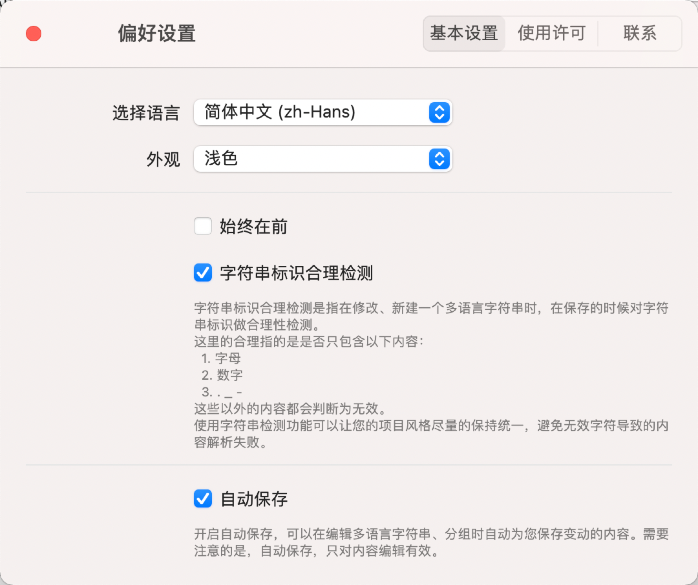

# Preferences 便好设置

跟所有app一样，Fella也有一个系统便好设置的页面，所有的设置内容会全局生效。

主要内容都在基本设置里，如图所示。

#### 1. 选择语言

用于选取您习惯使用的语言，暂时支持**简体中文**、**繁体中文**、**英文**、**日语**、**德语**，后续还会支持更多语言种类，所有内容翻译与支持均来自于各类翻译平台🙏。

#### 2. 外观

跟macOS系统便好设置的外观一样，支持**浅色**、**深色**、**跟随系统**，选择之后即可生效。

#### 3. 始终在前

会把Fella的所有窗口置顶显示。

#### 4. 打开文档时自动备份

用于在启动app时自动添加一个备份文件，方便后续恢复内容时使用，当然，如果您使用了Git来管理**i18nproj**文件的话，则就没有必要了。

#### 5. 字符串标识合理检测

字符串标识合理检测是指在修改、新建一个多语言字符串时，在保存的时候对字符串标识做合理性检测。
这里的合理指的是是否只包含**`字母`**、**`数字`**、**`._ -`**等字符，这些以外的内容都会判断为无效。
使用字符串检测功能可以让您的项目风格尽量的保持统一，避免无效字符导致的内容解析失败。

#### 6. 自动保存

开启自动保存，可以在编辑多语言字符串、分组时自动为您保存变动的内容。需要注意的是，自动保存，只对内容编辑有效。